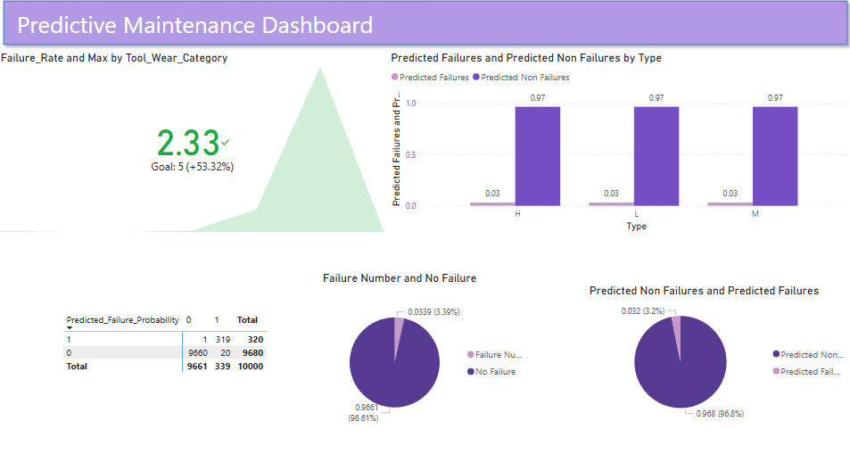

# predictive-maintenance-system

## Contents
1. [Project Overview](#project-overview)  
   - [Objectives](#objectives)  
2. [Data Description](#data-description)  
3. [Dashboard](#dashboard)  
4. [Technical Analysis](#technical-analysis)  
5. [Recommendations](#recommendations)  
6. [Questions, Assumptions, and Caveats](#questions-assumptions-and-caveats) 
   - [Questions](#questions)
   - [Assumptions](#assumptions)
   - [Caveats](#caveats)  
7. [How to Run the Project](#how-to-run-the-project)  
   - [Prerequisites](#prerequisites)  
   - [Installation](#installation)  
   - [Running the Project](#running-the-project)  
## Project Overview
The dataset contains 10,000 data points with 14 features, aiming to predict equipment failures. This project leverages the data to assess the likelihood of failures occurring.

Predictive maintenance can reduce downtime, optimize maintenance schedules, decrease costs associatied with unplanned failures, and improve overall operational efficiency.
### Objectives
- Data preparation and cleaning
- Splitting data into training and testing sets
- Building predictive models to assess failure probability
- Evaluating the accuracy of the model 
## Data Description
|Feature Name|Description|
|:-----------:|:---------:|
|UID|Unique Identifier|
|ProductID|Serial Number|
|Air Temperature|Room temperature in Kelvin|
|Process Temperature|Temperute during process in Kelvin|
|Rotational Speed|Rotational speed applied in RPM|
|Torque|Torque applied in Nm|
|Tool Wear|Duration of tool usage in minutes|

|Target|Description|
|:------:|:-----:|
|Target|Failure or not|
|Failure Type|Specific type of failure|
## Dashboard
The dashboard aims to visualize the data trends and provide insights for predective maintenance decisions.

## Technical Analysis
Random forest classification was chosen for the predictive maintenance due to how it can handle outliers and noise such as unexpected spikes in tool wears. Random forest is ideal for achieving high accuracy.
Logistic regression was selected to compare its performance against the more complex Random Forest model. 

The comparison aimed to evaluate whether the added complexity of Random Forest significantly improves the predective accuracy for maintenance failures.
|Model|Accuracy|Precision|Recall|F1-Score|
|-----|-----|------|------|-------|
|Random Forest|98.6%|99.9%|99.9%|99.9%|
|Logistic Regression|97.5%|99.9%| 99.9%|99.9%

Through Comparison and Improvement, tests when done by removing input feature that have the least correlation to the target. This led to the accuracy of the model to decrease. This might be due to issues such as the complexity of the model being lowered.
## Recommendations
- If model predicts a high probability of failure with the system, then schedule a preventative maintenance check
- Machines with high tool wear need to have more frequent inspections.
## Questions, Assumptions, and Caveats
### Questions
- How sensitivity is the model to missing data?
### Assumptions
- Assumed that the system works in a regular environmental condition
### Caveats
- Outliers detected in tool wear may represent error 
- Model may not be taking account of external factors (e.g. humidity)
## How to run the project
1. Prerequisites
    - Python 3
    - Jupyter Notebook
    - Libraries (pandas, scikit-learn, matplotlib)
2. Installation
    - git clone <repo_url>
3. Running the project
    - Open Failure prediction model.ipynb
    - run the cells sequentially 

