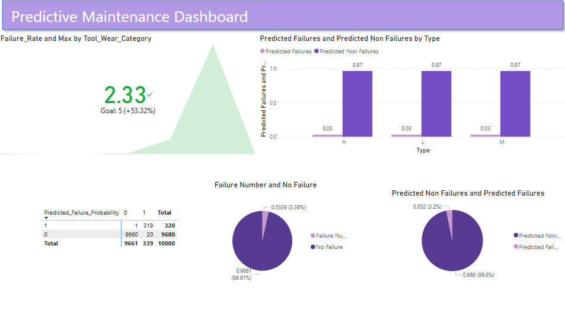
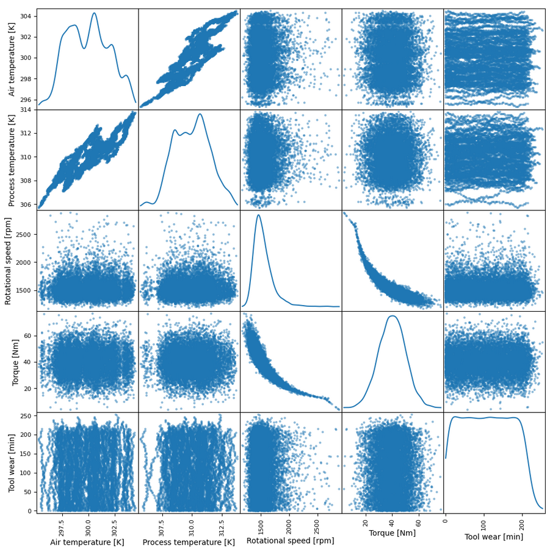

# predictive-maintenance-system

## Contents
1. [Project Overview](#project-overview)  
   - [Objectives](#objectives)  
2. [Data Description](#data-description)  
3. [Dashboard](#dashboard)  
4. [Technical Analysis](#technical-analysis)  
5. [Recommendations](#recommendations)  
6. [Questions, Assumptions, and Caveats](#questions-assumptions-and-caveats) 
   - [Questions](#questions)
   - [Assumptions](#assumptions)
   - [Caveats](#caveats) 
7. [How to Run the Project](#how-to-run-the-project)  
   - [Prerequisites](#prerequisites)  
   - [Installation](#installation)  
   - [Running the Project](#running-the-project)  
## Project Overview
The dataset contains 10,000 data points with 14 features, aiming to predict equipment failures. This project leverages the data to assess the likelihood of failures occurring.

Predictive maintenance can reduce downtime, optimize maintenance schedules, decrease costs associatied with unplanned failures, and improve overall operational efficiency.
### Objectives
- Data preparation and cleaning
- Splitting data into training and testing sets
- Building predictive models to assess failure probability
- Evaluating the accuracy of the model 
## Data Description
|Feature Name|Description|
|:-----------:|:---------:|
|UID|Unique Identifier|
|ProductID|Serial Number|
|Air Temperature|Room temperature in Kelvin|
|Process Temperature|Temperature during process in Kelvin|
|Rotational Speed|Rotational speed applied in RPM|
|Torque|Torque applied in Nm|
|Tool Wear|Duration of tool usage in minutes|

|Target|Description|
|:------:|:-----:|
|Target|Failure or not|
|Failure Type|Specific type of failure|
## Dashboard

The dashboard visualizes data trends to support predictive maintenance decisions. It effectively tracks the failure rate, keeping it below the 5% target. However, further improvements should aim to reduce the failure rate to 2%.

The dashboard reveals that tool wear duration has a strong correlation with the failure rate, highlighting the need for proactive maintenance.

The scatter matrix visualizes the correlation and distribution of different input variables. This helps identify potential issues or outliers that may require further analysis or handling.
## Technical Analysis
Random Forest classification was selected for predictive maintenance due to its robustness against outliers and noise, such as unexpected spikes in tool wear. Its ensemble learning approach enhances accuracy and reliability. Random Forest is ideal for achieving high accuracy.
Logistic Regression was selected to compare its performance against the more complex Random Forest model. 

The comparison aimed to evaluate whether the added complexity of Random Forest significantly improves the predective accuracy for maintenance failures.
|Model|Accuracy|Precision|Recall|F1-Score|
|-----|-----|------|------|-------|
|Random Forest|98.6%|99.9%|99.9%|99.9%|
|Logistic Regression|97.5%|99.9%| 99.9%|99.9%

Feature selection experiments showed that removing low-correlation inputs unexpectedly decreased model accuracy. This suggests that even seemingly less relevant features contribute to the overall predictive power, likely due to complex feature interactions. This suggests that reducing model complexity may negatively impact predictive performance.
## Recommendations
- If the model predicts a high likelihood of failure, a preventive maintenance check should be scheduled to avoid potential downtime.
- Machines with high tool wear need to have more frequent inspections.
- Regularly retrain the model with updated data to adapt to changes in machine behavior and improve accuracy over time.
- Frequent maintenance may reduce failures but increase operational costs. A balance between predictive accuracy and cost efficiency is crucial.
## Questions, Assumptions, and Caveats
### Questions
- How sensitive is the model to missing data?
- What impact does missing data have on the prediction accuracy, and what strategies can be used to mitigate this?
### Assumptions
- Assumed that the system works in a regular environmental condition
### Caveats
- Outliers detected in tool wear data may indicate errors in measurement or anomalies requiring further investigation.
- This suggests that reducing model complexity may negatively impact predictive performance.
## How to run the project
1. Prerequisites
    - Python 3
    - Jupyter Notebook
    - Libraries (pandas, scikit-learn, matplotlib)
2. Installation
    - git clone <https://github.com/1102Aryan/predictive-maintenance-system.git>
3. Running the project
    - Open Failure prediction model.ipynb
    - run the cells sequentially 

